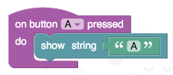

#Responsiveness

From the very conception of the micro:bit it has always been regarded as
a reactive system. The primary users are between the ages 11 and 12 so it's very
important that the micro:bit is seen to react in a timely manner. Any delay or lack
of responsiveness can be the difference between frustration and enthusiasm.

The design of the software therefore lends itself to an event driven model.

## Message Bus

The [`MicroBitMessageBus`](ubit/messageBus.md) is the core mechanism that enables
the reactivity exhibited by the micro:bit. The [`MicroBitMessageBus`](ubit/messageBus.md)
consumes [`MicroBitEvent`](data-types/event.md)s and delivers these events asynchronously
to listeners created with a call to `uBit.MessageBus.listen`.

The [`MicroBitMessageBus`](ubit/messageBus.md) has many purposes:

- It provides an abstraction that is platform independent.
- It provides a mechanism to decouple user and system code.
- It supplies a common, high level eventing abstraction across many different hardware and software
  components.
- It supports extensibility for new components that are introduced via I/O pins.
- It optimises event/data distribution through aggregation, saving energy in the
  process.

## Events

For nearly every core component of the runtime, events are used as a mechanism
to signal a specific 'thing' has occurred. In the runtime, this is exposed as a
[`MicroBitEvent`](data-types/event.md).

User or system code can then listen for when these events occur on the shared Message Bus
and perform specific actions as a result.

When a [`MicroBitEvent`](data-types/event.md) is created, it is placed
onto the shared Message Bus. Any listeners listening to the ID and Value specified
in a [`MicroBitEvent`](data-types/event.md) will be executed depending
on the [`MicroBitEventLaunchMode`](something.md).

Another important usage of events is to escape interrupt context. [`MicroBitEvent`](data-types/event.md)s
can be created and queued in interrupt context. Listeners are then executed outside interrupt context,
which means that allocation of memory in the user written handlers is entirely safe.

Below are two equivalent examples of this mechanism in operation, using the native C++
calls, and the Microsoft Blocks environment.

### C++ Example

```cpp
void onButtonA(MicroBitEvent e)
{
    uBit.display.print('A');
}

uBit.MessageBus.listen(MICROBIT_ID_BUTTON_A, MICROBIT_BUTTON_EVT_CLICK, onButtonA);
```


### Blocks Example



## Listeners

Listeners have been briefly covered before, and they are primarily used as a decoupling
mechanism for the runtime.

Listeners transform the traditional concept of:
```pseudo
if (this)
    do that
```
Into:

```pseudo
on (this):
    do that
```

Of course, the prior is still possible in the runtime.

Listeners are either executed in the idle fiber, or in their own fiber (created by the MessageBus),
unless explicitly indicated otherwise in the [`MicroBitEvent`](data-types/event.md)
that is placed onto the [`MicroBitMessageBus`](ubit/messageBus.md).

!!!note
    This is achieved through changing the [`MicroBitEventLaunchMode`](something.md)
    when constructing the [`MicroBitEvent`](data-types/event.md)

There are a number of different variations of `listen` applicable to the shared [`MicroBitMessageBus`](ubit/messageBus.md).
This means as well as the ability to call standard functions, member functions can also be
called on the reception of an event from the [`MicroBitMessageBus`](ubit/messageBus.md).

There also exists a form of reflection for the [`MicroBitMessageBus`](ubit/messageBus.md).
Each time a listener is created, and successfully added, an event is created, with
the ID of the [`MicroBitMessageBus`](ubit/messageBus.md), and the id of the newly
added listener. This is used in the runtime to provide lazy instantiation for
components that are not always fully utilised by users.

#Concurrency

## Scheduler

## Fibers
